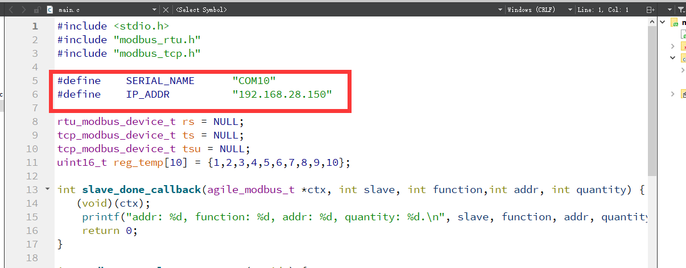
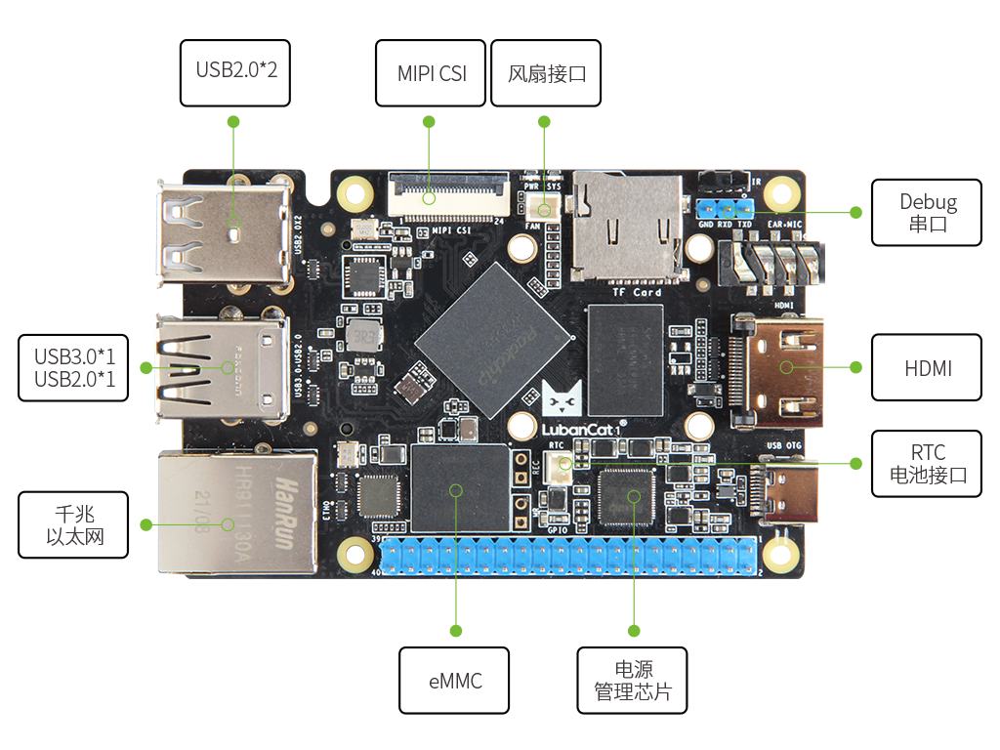
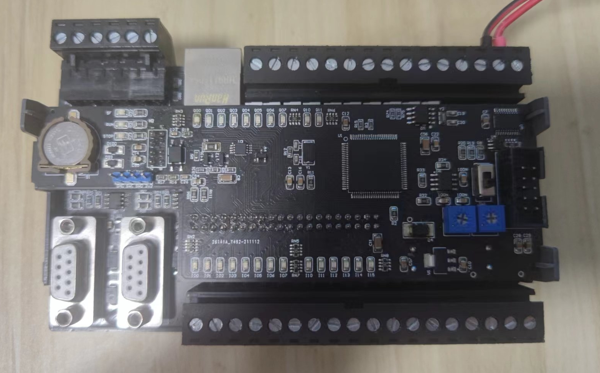
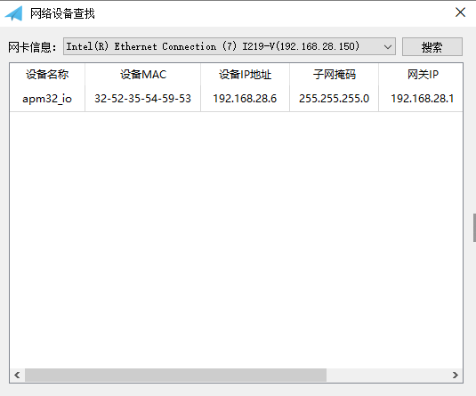
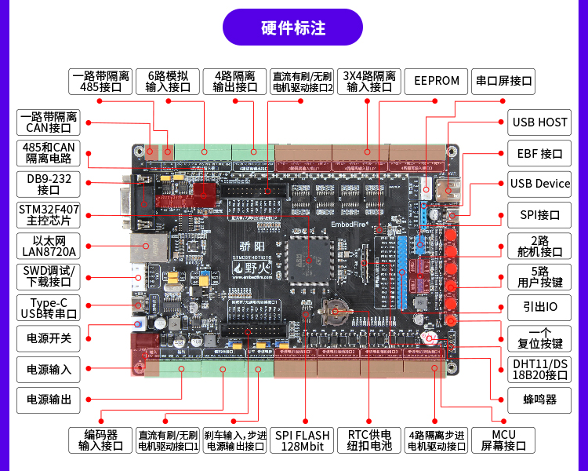
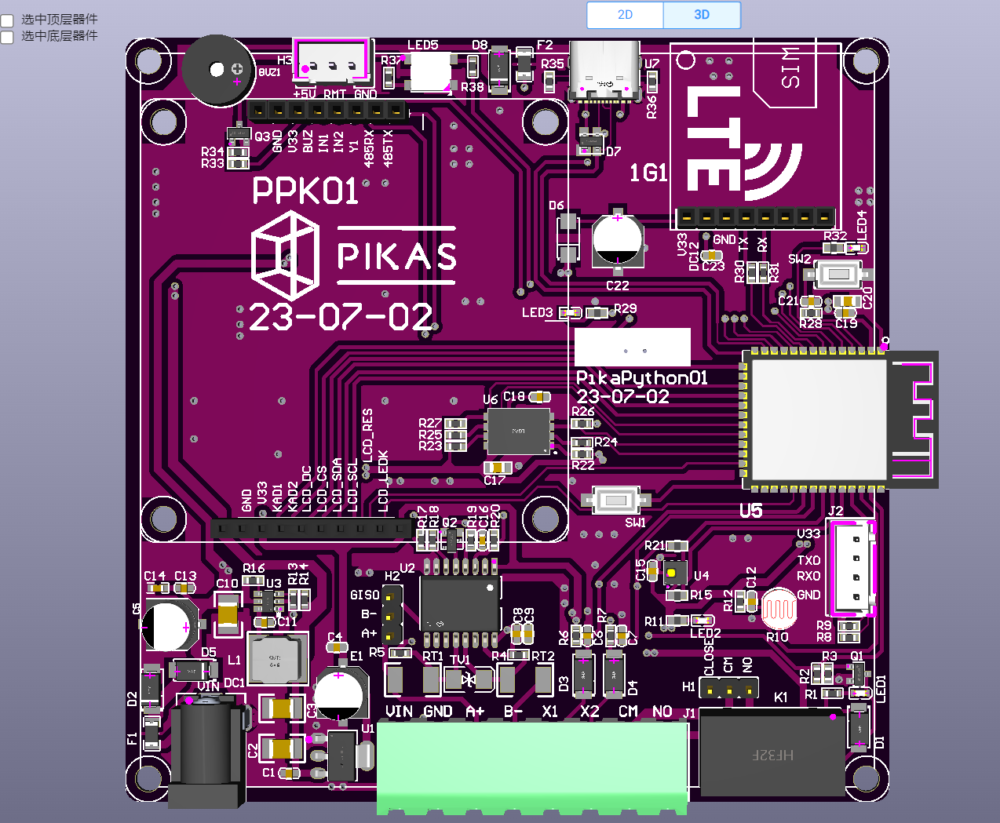
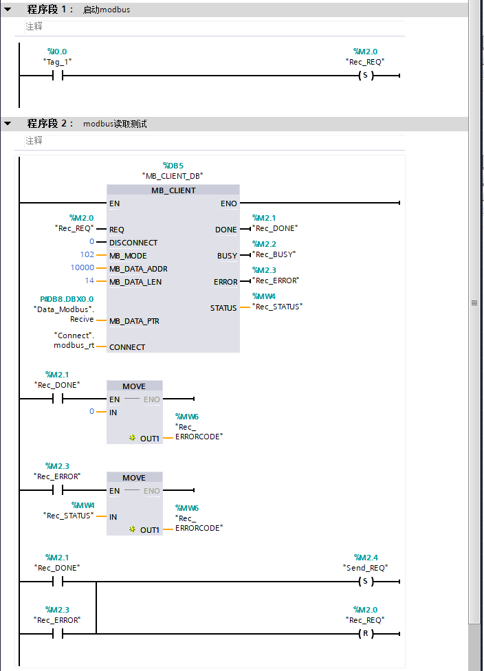
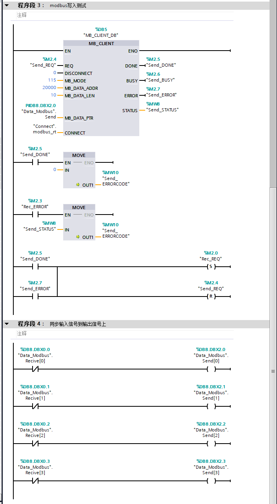
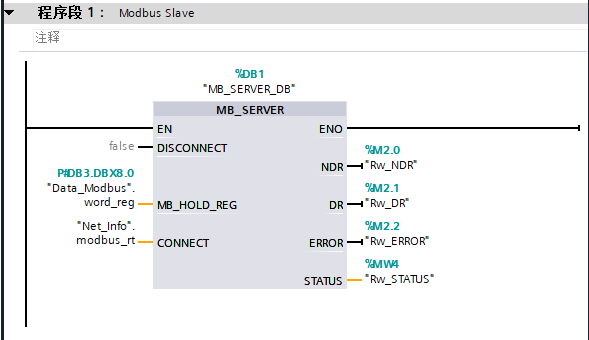
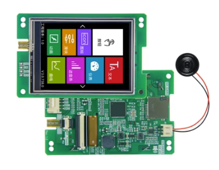

# modbus_rt：纯C实现的跨平台modbus协议通信库

该项目的演示视频，详见：

​	B站：https://www.bilibili.com/video/BV1cc411m72m/

### 一、介绍

​		modbus_rt是一款完全基于C语言实现的可以运行在windows, linux,  macos， RTOS上的modbus通信库。主要目的是针对控制系统和工业物联网的方向使用。modbus_rt可以同时支持slave模式和master模式，基于类似socket句柄的实现思想，可以很方便的支持多例模式。它不仅仅是modbus协议的解析和实现，而是尽可能的在应用层做好实现和封装，做到开箱即用，而不需要做过多的应用层移植。

​		modbus_rt支持几乎市面上常用的所有的modbus协议的实现，包括**modbus RTU**，**modbus ASCII**，**modbus TCP**，**modbus TCP over UDP**，**modbus RTU over TCP/UDP**, **modbus ASCII over TCP/UDP**，且都可以运行在**Slave模式**和**Master模式**。另外modbus_rt提供了modbus通信中的大小端转换函数接口(市面上**4种大小端模式**均支持)，实现不同平台下的modbus寄存到各种数据的转换接口函数功能（包括bytes, string, int, long, float, double等）。

​		modbus_rt还额外提供了基于pikapython的接口实现，可以采用python脚本实现modbus通信功能。可以无缝兼容到pikapython的环境当中（后续可能考虑提供基于micro python和Cpython的接口实现，本人对micro python和Cpython的底层封装不是很熟悉，看情况，不一定有时间，感兴趣的可以自己移植）。

​		另外由于modbus_rt采用纯C编写，后续会考虑支持编译封装为动态链接库，供其他编程语言调用（主要考虑给C#调用，目前主要的控制上位机平台基于QT或者C#居多），目前暂时没有封装dll，所以仅提供基于QT的demo。

##### 1、 modbus_rt的主要特性如下：

1. 可以无缝运行在市面上绝大部分平台，包括：windows，Linux，嵌入式RTOS系统当中（计划会维护rt-thread和FreeRTOS系统）。
2. 采用线程实现应用层接口，可以快速实现多个modbus 实例应用。支持几乎所有的modbus协议，且均支持Slave模式和Master模式。
3. 同时支持市面上4种不同模式的大小端数据转化接口，实现不同平台下的modbus寄存到各种数据的转换接口函数功能（包括bytes, string, int, long, float, double等）。
4. 基于面向对象的思维方式，采用句柄模式，非常方便实现modbus的多例模式。理论上只要性能，内存和空间足够，可以创建无数个modbus实例。
5. **modbus master在tcp模式下支持断线重连功能（包括tcp master和rtu/ascii master over tcp）**。在modbus的网络通信中，由于slave是服务端，master为客户端，可能由于网络或者服务端的原因（有些服务端为了保证性能是会自动做短链接处理。就是每进行一次modbus通信之后，会主动断开与客户端的连接，以减小性能开销）。这种情况下，会出现master每次通信需要判断服务端有没有断开，如果断开则需要重新建立连接。modbus_rt内部支持断线重连机制，即使由于网络或者服务端原因断开了连接，下次通信不需要重新建立连接。直接调用功能函数即可，应用框架会自动进行重连（内部有功能调用时重连和定时重连两方面处理，定时重连可以通过宏定义打开或者关闭——针对具有自动断开机制的服务端系统，可以考虑关闭定时重连，否则服务端断开之后系统会间隔的尝试与服务器进行重连。针对其他应用，开启定时重连的目的时为了防止由于网络或者超时原因导致的断开，系统会自动进行重连）。
6. **基于UDP通信接口之上modbus模式下，提供了网络设备查找和发现功能**。即：modbus slave端（一般可以称为设备端，以下简称设备端）与modbus master端（一般PC客户端或者应用端，以下简称客户端）为同一个路由器或者交换机下面的不同设备时。即使设备端与客户端的IP地址不在同一个网段下（设备端IP地址未知），可以由客户端通过往255.255.255.255的广播地址广播modbus命令，设备端收到广播信息后会对广播设备的ip地址进行检测，如果与设备不在同一个网段，会默认往255.255.255.255广播应答信息。这个时候，客户端就可以获取到modbus_rt设备端的ip地址。这样就可以实现设备地址的发现。另外基于此基础上可以扩展实现修改设备的IP地址的功能（详细可以参考rt-thread平台演示）。
7. **mdobus_rt在slave模式下，增加了set_pre_ans_callback和set_done_callback两个回调函数调用接口**。方便快速实现modbus协议与其他协议的转换。比如modbus RTU，ASCII，TCP之间的相互转化， modbus转mqtt，modbus转sql， modbus转OPC Client， modbus转profibus，modbus转canOpen等协议（第三方协议需要自己实现）。可以快速实现类似DTU的应用，以适应各种工业物联网的应用需求（详细可以参考modbus dtu案例演示）。
8. **modbus_rt提供脚本的应用层接口API，目前实现基于pikapython**（主要是考虑到pikapython本身采用python3语法，且支持windows，linux，RTOS，甚至无系统的跨平台支持），并且支持脚本解析运行模式和字节码运行模式，且提供了REPL的交互式运行模块。所以可以无缝集成到系统当中，也可以采用类似终端的方式，基于REPL的命令行模式来验证功能。

##### 2、 modbus_rt的几点补充说明：

1. modbus_rt的协议解析部分基于开源的agile_modbus协议栈修改而来。针对slave_util部分做了重写，主要是支持动态绑定slave寄存器，甚至可以运行中增加slave寄存器。
2. 在基于windows，linux（理论上也可以运行在macos系统）上的串口通信部分采用了开源的libserialport串口通信库，采用加载动态链接库的形式调用，RTOS部分串口通信代码为自己编写。
3. modbus_rt的网络通信部分，采用BSD Socket接口，所以理论上只要可以支持BSD Socket的平台都可以使用，需要注意的是：为了实现多个socket的阻塞问题，采用了IO多路复用接口（select机制），所以需要系统支持select接口。windows和linux本身就都支持，RTOS系统需要确保系统已经移植了BSD socket并且支持select。
4. modbus_rt的应用实现层采用多线程，在windows，linux，macos等操作系统上采用了pthread多线程。linux和macos默认支持pthread，windows需要自己加载和安装pthread库。
5. 本项目参考和借鉴使用了包括但不仅限于以下开源的项目：agile_modbus,  libserialport, PikaPython, PikaPython-OpenHardware, RT-Thread, FreeRTOS等等(如还有没有标注的项目，请注明)。采用和借鉴了的开源项目地址详见最后感谢栏，欢迎大家点赞相互交流学习。感谢以上的开源项目作者。

### 二、重大的更新记录

##### 1、2024-01-31更新内容

 1. 把SLAVE_DATA_DEVICE_BINDING宏定义，修改为SLAVE_DATA_DEVICE_BINDING宏定义和dev_binding标志变量共同决定是否需要把SLAVE的硬件外设绑定到寄存器当中。所以在设备需要绑定硬件外设时，需要额外调用 modbus_xxx_set_dev_binding(xxx_modbus_device_t dev, int flag)函数来实现绑定变量，否则默认为不绑定，可以作为完全独立的modbus实例存在。这样做的目的是为了在交互端，PC上基于DTU的代码可以几乎不用移植的在嵌入式设备上运行。

 2. 基于modbus的添加文件传输功能（类似tftp，采用mosbus自定义功能码实现，功能码可以在mosbus_p2p.h中自行修改），可以用该功能实现固件升级(可选择加载加密代码实现固件的加密传输和升级)。另外可以实现串口，网络直接传输pikapython的字节码到设备端（如果设备端有文件系统支持），设备端直接运行字节码，使得在设备端运行pikapython更加高效和便捷。（该功能可以通过宏定义打开或者关闭，关闭文件传输功能，与之前版本兼容）。

 3. 整合到pikaPython的官方仓库，可以直接使用pikaPython的包管理工具加载和更新。并且对大小端转化、RTU和TCP做了分割，方便只需要使用Modbus TCP或者只需要使用modbus RTU的用户，也可以快速modbus_rt到项目中（需要RTOS或者操作系统支持，暂时不支持裸机运行modbus_rt）。

 4. 把modbus中的协议解析部分，与agile modbus同步更新到1.1.4版本的agile modbus

    > **需要特别注意的是：**考虑到第1条可能会导致部分使用之前版本代码的用户（仅限在设备端，绑定了硬件本身的IO外设的情况下）在升级到最新版本之后，可能会有一定的兼容性问题（需要在创建modbus slave实例之后，除开需要把宏定义SLAVE_DATA_DEVICE_BINDING设置为1打开，还需要增加额外增加一条modbus_xxx_set_dev_binding函数，才可以实现完全的与硬件绑定功能）。如果不需要以上功能的用户可以直接使用betaV0.1版本。

### 三、测试与使用

##### 1、 windows平台

​		windows平台我们这里我们采用QT+MSVC来编译进行测试（理论上用Visual Studio—本身就是基于MSVC，或者MiniGW—基于GCC都可以），我们提供了两个demo：modbus_rt_slave_test和pikapython_test。

1. modbus_rt_slave_test测试程序会运行三个modbus示例，分别为modbus rtu slave， modbus tcp slave和modbus tcp slave over udp。我们可以通过任意一种modbus与其进行通信，这里我们直接用第二个案例pikapython_test来测试（当然也可以用其他软件或者设备进行通信，比如：modbus poll软件）。直接用QT打开工程修改电脑上的串口号和电脑所用网卡的ip地址，编译即可。



1. pikapython_test测试程序基于pikapython搭建了modbus_rt的python运行环境，我们可以直接执行python程序测试modbus通信。也可以在REPL交互式终端中运行测试，该demo可以运行所有的modbus实例。在```example\code_py```中有我们写好的modbus测试程序。同时为了方便测试。同时我们提供了编译完成之后的可执行程序，在```example\windows\pikapython_test_release```目录下，可以直接双击```pikapython.exe```直接运行REPL环境，也可以在终端中输入```pikapython xxx.py```运行对应的py文件（注意需要先把终端运行目录运行到该目录下，把需要执行的程序也拷贝到该目录下）。

这里我们简单测试用pikapython_test程序，运行```rtu_master.py```、```tcp_master.py```、```udp_master.py```来进行基本功能测试，详细测试方法可以参考演示视频（这里就不赘述了）：

​		我们也可以基于pikapython_test左更多的功能，可以参考后面的案例。

​		如果需要编译到自己的应用程序中，只需要把src目录的代码复制到工程当中去，安装pthread库和libserialport库，自己添加好头文件即可，可以参考我们提供的两个QT+MSVC的源码工程。

##### 2、Linux平台

​		Linux平台硬件理论上只要时标准的linux系统都可以使用。这里我采用了野火的鲁班猫1作为测试平台，基于瑞芯微（Rockchip）的RK3566平台。主要是手头刚好又这个开发板，而且而且目前市面上很多ROS机器人系统都采用了这块开发板，具有一定的代表性，modbus_rt时上层的应用开发API，所以实际上与硬件无关。



​		linux系统我们提供了和Windows功能一样的两个demo。我们直接编译即可运行。由于linux环境搭建可能针对初学者有些难度，这里简单简述以下编译环境的构建和编译过程。详细的测试方法可以参考演示视频，视频中我们提供了一个案例，就是用两个USB转485的线分别连接windows和linux。然后进行相互通信测试。

​		这里我们刷了野火提供的最新的debian桌面版本的固件。确保安装了git, cmake和gcc程序，如果没有安装可以通过```sudo apt install cmake``` 和```sudo apt install git```来安装（由于我的开发板系统安装在EMMC中，而flash空间不够，所以代码是在tf卡中编译的，我把tf卡挂载到了```/home/cat/sdcard```目录下，需要注意给```/home/cat/sdcard```目录操作权限）

```shell
sudo mount /dev/mmcblk1 /home/cat/sdcard
sudo chown -R cat /home/cat/sdcard
chmod -R 755 /home/cat/sdcard
```

> 注意：如果要在linux下编译libserialport，还需要安装autotools相关工具，因为libserialport是在linux下是基于autotools工具编译的，如果需要编译libserialport下面的example示例，可能还需要安装pkg-config工具。请更具提示安装对应的编译工具

1. 下载libserialport和modbus_rt的源代码，libserialport的地址详见最后的参考的项目地址中。

```shell
git clone https://github.com/sigrokproject/libserialport.git
git clone https://github.com/SenySunny/modbus_rt.git
```

2. 安装autotools工具和pkg-config工具

```shell
sudo apt-get install autotools-dev autoconf automake libtool
sudo apt-get install pkg-config
```

3. 编译和安装libserialport库

```shell
cd libserialport/
./autogen.sh 
./configure 
make
sudo make install
sudo ldconfig
```

4. 如果需要运行libserialport下的案例，可以进入examples目录下，执行make编译。

```shell
cd examples/
make
```

   ​	 此时你可以运行案例，比如以下是运行```./list_ports```的结果，显示由两个串口，一个是系统调试串口，一个是我外界的USB转串口模块：

```shell
cat@lubancat:~/sdcard/libserialport/examples$ ./list_ports 
Getting port list.
Found port: /dev/ttyFIQ0
Found port: /dev/ttyUSB0
Found 2 ports.
Freeing port list.
```

5. 编译和运行modbus_rt(注意编译前线修改代码中的ip地址和串口号等信息)

```shell
cd ~/sdcard/modbus_rt/example/linux/modbus_rt_slave_test
sh make.sh
sudo build/modbus_rt_linux 
```

6. 如果要运行pikapython_test案例，编译方法一样，

```shell
cd ~/sdcard/modbus_rt/example/linux/pikapython_test
sh make.sh
sudo build/modbus_rt_linux 
```

​			或者进入目录运行特定的文件，例如下面即直接运行目录下的test.py文件：

```shell
cd build
sudo ./pikapython test.py 
```

7. 可以运行和测试modbus_rt相关功能

​		测试方法和windows一样，需要注意的是，linux终端和windows略有不同，windows的终端可以直接输入程序名称运行程序，而linux终端输入程序名称会检测环境变量下的有没有该名称的程序，并不会直接运行目录下的程序，所以需要输入```.\pikapython``` 或者运行```.\pikapython xxx.py```运行程序，另外，如果程序中socket用到了1024以下的端口号，比如modbus默认的502，需要用管理员模式运行，需要输入```sudo .\pikapython```或者```sudo .\pikapython xxx.py```运行程序。因为linux系统默认用户不能使用1024以下的端口号。

> 还有一点需要注意：如果用windows系统或者linux系统作为设备端使用。开启基于udp的slave模式。希望开启设备IP查找功能，windows系统创建slave设备的时候，需要指定网卡的ip地址，类似windows测试时的“192.168.28.150”。linux系统或者RTOS系统下BSD socket则需要用NULL或者空子字符串“”来指定采用默认IP地址。否则接收不到来自255.255.255.255的广播数据包。

##### 3、RT-Thread平台

​		RT-thread平台演示提供了两套硬件，其中一套硬件是自己DIY的一块PLC开发板，考虑到使用者并没有这个板子做验证，另外这个板子的网络部分采用了W5500的网络芯片来实现的，增加了STM32+lan8720A+lwip的案例演示，该开发板基于”野火STM32F407_骄阳开发板“来实现，关于该开发板的资料可以参考”野火资料下载中心：https://doc.embedfire.com/products/link/zh/latest/mcu/stm32_motor/ebf_stm32f407_jiaoyang/download/stm32f407_jiaoyang.html “

###### （1） 基于APM32E103VET6 + W5500

​		RT-thread平台演示采用了我之前自己DIY的一块PLC开发板，外壳完全兼容西门子的S7-200的PLC外壳，主控这里采用国产的珠海半导体的APM32E103VET6芯片（基本兼容STM32F103VET6，引脚Pin2Pin兼容，但是RAM时STM32的2倍，128K，STM32只有64K，另外APM32的主频为120Mhz），网络部分采用W5500网络芯片。运行rt-thread系统。电路图和测试代码可以见```example\rt-thread\apm32e103vet6```



​		

​		该硬件有两个RS485接口，我们代码默认靠近网卡的RS485作为终端测试使用，我们连上网线，RS485线缆(一个用于modbus通信，一个用于终端调试)，上电，编译下载到硬件平台之后。我们可以通过modbus poll控制和读取IO的状态，也可以使用前面编译好的windows或者linux应用程序在终端运行modbus master示例，与其通信。

> ​		这里对代码做简要的说明，我们创建了三个slave示例，一个用于modbus rtu slave on RS485，一个modbus tcp slave，一个基于modbus tcp slave over udp。其中udp的slave支持设备查找功能。
>
> 寄存器分布如下：
>
> 0x寄存器：	20000~				: DO输出寄存器
>
> 1x寄存器：	10000~				：DI输入寄存器（只读）
>
> 3x寄存器：	8000-8007			: 存储设备的基本信息
>
> ​						8008-8015	  	：设备的硬件地址(这里便是MAC地址），注意8008存储的式地址长度
>
> ​														（这里是6），8009-8011存储的是MAC地址，8012~8015这里没有使用。
>
> ​						8016-8025		:	这里存储的是设备的网络信息分别是IP地址，子网掩码，网关地址，
>
> ​														首选DNS服务器，备用DNS服务器。每个占用2个地址。
>
> 4x寄存器：	2008-2015	    ： 引入MAC地址匹配功能，针对广播修改网络信息功能。定义与8008-8015相同。
>
> ​						2016-2027		： 修改网络信息地址寄存器，2016-2025地址分别是IP地址，子网掩码，
>
> ​														网关地址，首选DNS服务器，备用DNS服务器，每个占用2个地址。
>
> ​														2016为修改确认标识，表示修改哪些信息，可以取值为0~5。
>
> ​														默认0不修改，
>
> ​																1	表示只传递ip，子网掩码和网关采用默认（子网掩码默认
>
> ​																		255.255.255.0，网关地址默认为ip同一网段下的xxx.xxx.xxx.1）;
>
> ​																2	表示只传递ip和子网掩码,网关采用默认；
>
> ​																3	表示ip，子网掩码和网关同时修改)
>
> ​																4	增加修改首先DNS服务器
>
> ​																5	所有的信息都修改。
>
> ​													2017为开启DHCP模式，设置1则表示开启，仅对当前有效，设置后DHCP获取
>
> ​													到的IP地址等网络信息会存储在3x寄存器的8016-8025当中，重启之后，系统
>
> ​													会回到静态ip模式，并把上次DHCP的IP作为静态IP来设置，所以该模式作用于
>
> ​													在不知道路由器可用IP的情况下让路由自动给设备分配一个ip使用。

​		该代码和windows和linux的modbus_rt_slave_test功能一致，即运行三个modbus slave实例，分别基于RS485，tcp和udp。其中udp我们增加了网络搜索设备和修改设备网络信息的功能。同时我们基于QT编写了一个查找和修改设备网络信息的上位机程序（本身也是基于modbus_rt），在```example\windows\tools\find_device```目录下，我们编译程序下载到单片机之后，就可以用这个软件查找和修改设备的IP了（该软件查找设备支持多设备同时查找，但是修改跨网段的设备的网络信息是默认不支持多设备，这里主要的原因是：查找设备是通过广播查找，但是如果发现设备与电脑不在同一个网段，则会通过广播修改网络信息，但是如果发现设备本身和电脑在同一个网段，则会使用定向ip地址发送信息）。

> 针对RT-Thread平台代码做了修改，增加了MAC地址匹配功能，这样便支持跨网段的多设备修改功能了（需要注意的是：MAC地址匹配功能不属于modbus_rt应用框架内的功能。需要自己应用端去实现和匹配，且一定要确保MAC具有唯一性，如果多设备的MAC一样，该功能可能会导致问题。最新版本的固件代码已经增加MAC地址匹配功能。）。

​		目前查找和修改设备IP上位机目前只提供window平台，linux平台暂时未提供，使用方法将建演示视频。



###### （2） 基于STM32F407 + lan8720A + lwip

######  

​        这里我们基于野火STM32F407_骄阳开发做了两个demo，demo的功能和windows基于Linux平台的功能一样，这里需要注意的是：

1. 第一个demo和基于APM32E103VET6的demo一样，增加了网络设备查找的功能，可以通过”查找和修改设备IP上位机“进行设备发现和修改设备的网络信息。
2. 第二个demo由于是在嵌入式平台运行python代码。考虑的文件的传输，这里利用开发板上的SPI Flash 建立了一个FAT文件系统，把其绑定在USB_DEVICE_MSTORAGE设备上，这样就可以把开发板作为一个U盘来使用了。需要拷贝python文件的时候，直接接入USB设备，文件系统就会挂在到USB_DEVICE_MSTORAGE设备上，这时候可以拷贝和编辑里面的PikaPython的python代码。编辑保存完毕之后断开USB，此时文件系统会直接挂在在FATFS文件系统下面，此时便可以通过MSH的命令行执行相应的python代码。（当然，还有很多其他方式可以实现，比如通过TFTP等协议传输文件，这里只是提供了一个demo示例）
3. 另外，在code_py中增加了一个用STM32实现modbus TCP转RTU的DTU的案例，由于我们在STM32上已经做了寄存器绑定，所以这个demo和在PC上略微有一点不同，代码如下：

```python
import modbus_rt
import modbus_rt_defines as cst

serial_name = "uart4"
ip_addr = ""

rm = modbus_rt.rtu(cst.MASTER)
rm.set_serial(serial_name)
rm.open()
ts = modbus_rt.tcp()
ts.set_net(ip_addr, 502, cst.SOCK_STREAM)
def pre_call(evt) :
    slave = evt.slave
    function = evt.function
    addr = evt.addr
    quantity = evt.quantity
    if cst.READ_DISCRETE_INPUTS == function: 
        if addr >= 0 and addr <= 16 :
            data = rm.excuse(slave, function, addr + 10000, quantity)
            ts.excuse(cst.WRITE, cst.INPUTS, addr, quantity, data)
    elif cst.READ_COILS == function: 
        if addr >= 0 and addr <= 16 :
            data = rm.excuse(slave, function, addr + 20000, quantity)
            ts.excuse(cst.WRITE, cst.CIOLS, addr, quantity, data)
def done_call(evt) :
    slave = evt.slave
    function = evt.function
    addr = evt.addr
    quantity = evt.quantity
    if cst.WRITE_SINGLE_COIL == function: 
        if addr >= 0 and addr <= 16 :
            data = ts.excuse(cst.READ, cst.CIOLS, addr, 1)  
            rm.excuse(slave, function, addr + 20000, data[0])  
    elif cst.WRITE_MULTIPLE_COILS == function: 
        if addr >= 0 and addr <= 16 :
            data = ts.excuse(cst.READ, cst.CIOLS, addr, quantity)  
            rm.excuse(slave, function, addr + 20000, quantity, data)  
ts.set_strict(0)
ts.set_pre_ans_callback(pre_call)
ts.set_done_callback(done_call)
ts.open()

```

​        该代码执行的效果是，如果写20000线圈寄存器，则默认是写DO输出操作，如果写的是地址0的线圈寄存器，则会默认为通过RTU写扩展IO模块的20000线圈寄存器；同样的，如果是读10000离散输入寄存器，则默认读取的是开发板的DI输入，但是如果读取的是0的离散输入寄存器，则会默认通过RTU读取扩展模块的10000寄存器。这样就方便的对IO外设进行扩展，或者以支持以太网的设备作为主控，以RTU外设作为从机。实现主机对从机的调度。另外通过主机设备像上位机或者云端上传信息的功能。

##### 4、FreeRTOS平台

​	FreeRTOS平台，我们计划用了PikaPython的开源硬件 PikaPython-OpenHardware作为demo测试平台，该开发板基于ESP32-S3平台，本身又配置RS485接口，另外网络部分可以用wifi进行测试。



PikaPython-OpenHardware的开源地址为：[https://gitee.com/Lyon1998/pikapython_openhardware ](https://gitee.com/Lyon1998/pikapython_openhardware)

平台的测试代码仓库（基于idf V5.1开发环境）（暂时还没有移植，后续移植维护）：

##### 5、mosbus_rt与西门子PLC进行通信

​		因为我们以上4个平台的接口部分都是采用PikaPython封装的API，采用脚本进行通信，所以测试用哪个平台无所谓，西门子PLC我们采用比较常用的S7-1214C的PLC平台，这里仅仅测试modbus TCP，我们提供两个demo：

1. S7-1214C运行modbus TCP master案例，连接到我们rt-thread平台硬件上，把rt-thread开发板作为西门子PLC的扩展modbus IO模块使用。这里我们简单做了一个应用，采样S7-1214C的I0.0作为启动连接到IO的信号，之后把rt-thread开发板的DI输出到DO中，此时我们输入板子的DI，对应的DO就有输出。详细可以参考演示视频。



2. S7-1214C运行modbus TCP slave案例，利用windows或者linux上运行的mobus_rt 运行的master操作西门子PLC的外设（包括I Q IW和自定义的保持寄存器，I对饮的1x寄存器，Q对应的0x寄存器，IW对应的3x寄存器），详细可以参考演示视频。



​		PLC工程详见example/PLC目录，工程采用博图V15.1创建工程。

##### 6、modbus_rt与组态屏进行通信

​		威纶通组态屏程序，我们用威纶通的MT8071IP组态屏，结合我们的RT-Thread平台硬件，进行DO控制和DI检测示例。威纶通屏幕的工程详解example/WEINVIEW，采用EBproV6.08.02.500打开下载。理论上其他的组态屏操作也基本一致，这里就不一一测试了。


​		这里我们只是写了一个用威纶通屏幕读取DI并写入DO控制开发板的简易Demo, 监控四路输入和4路输出。组态屏屏本身可以通过modbus实现的功能非常强大，这里就不赘叙了。


##### 7、modbus_rt与国产大彩串口屏进行通信

​		考虑到很多成本敏感的项目或者用户并不会使用组态屏（主要价格贵）。所以这里我们也采用国产的大彩串口屏做了一个demo示例，国产的串口屏性价比就高很多了。大彩串口屏，很多型号都支持modbus协议，价格甚至只需要几十元就可以搞定，这里我们选择了一款2.8寸的串口屏，型号：DC24320M028_1110_0T。我们通过该串口屏实现和组态屏一样的功能，实现对DI的监控和DO的控制。



​		大彩串口屏的工程见example/DACAI，软件采用VisualTFT_3.0.0.1232，界面如下：


​		由于我采用的大彩串口屏时RS232/TTL-UART接口的，所以这里演示的时候采用了TTL-UART，外接了一个TTL转RS485模块，最终接到我们的RT-thread开发板上。

##### 8、mobus DTU相关示例

​		这里做一个简单的示例，实现modbus TCP转modbus RTU功能。我们用Linux系统开发板上接入USB转RS485模块，连接到rt-thread平台硬件上（用来模拟基于modbus rtu的外设——比如IO模块，传感器外设）。然后再windows上运行modbus tcp master，与linux通信，实现对rt-thread平台硬件上的IIO控制。

​	这里主要验证利用modbus_rt的回调函数功能实现dtu转换功能。

1. 首先进入linux平台下的build目录：

```shell
cd ~/sdcard/modbus_rt/example/linux/pikapython_test/build
```

2. 创建一个```tcp2rtu_dtu.py``` 文件，并复制如下代码：

```python
import modbus_rt
import modbus_rt_defines as cst

serial_name = "/dev/ttyUSB0"
ip_addr = ""

rm = modbus_rt.rtu(cst.MASTER)
rm.set_serial(serial_name)
rm.open()
ts = modbus_rt.tcp()
ts.set_net(ip_addr, 502, cst.SOCK_STREAM)
def pre_call(evt) :
    slave = evt.slave
    function = evt.function
    addr = evt.addr
    quantity = evt.quantity
    if cst.READ_HOLDING_REGISTERS == function: 
        data = rm.excuse(slave, function, addr, quantity)
        ts.excuse(cst.WRITE, cst.REGISTERS, addr, quantity, data)
    elif cst.READ_DISCRETE_INPUTS == function: 
        data = rm.excuse(slave, function, addr, quantity)
        ts.excuse(cst.WRITE, cst.INPUTS, addr, quantity, data)
def done_call(evt) :
    slave = evt.slave
    function = evt.function
    addr = evt.addr
    quantity = evt.quantity
    if cst.WRITE_SINGLE_COIL == function: 
        data = ts.excuse(cst.READ, cst.CIOLS, addr, 1)  
        rm.excuse(slave, function, addr, data[0])  
    elif cst.WRITE_SINGLE_REGISTER == function: 
        data = ts.excuse(cst.READ, cst.REGISTERS, addr, 1) 
        rm.excuse(slave, function, addr, data[0])  
    elif cst.WRITE_MULTIPLE_COILS == function: 
        data = ts.excuse(cst.READ, cst.CIOLS, addr, quantity)  
        rm.excuse(slave, function, addr, quantity, data)  
    elif cst.WRITE_MULTIPLE_REGISTERS == function: 
        data = ts.excuse(0, cst.REGISTERS, addr, quantity)  
        rm.excuse(slave, function, addr, quantity, data)    
ts.add_block("A", 0, 20000, 10)
ts.add_block("B", 1, 10000, 16)
ts.add_block("C", 4, 0, 10)
ts.set_strict(0)
ts.set_pre_ans_callback(pre_call)
ts.set_done_callback(done_call)
ts.open()

```

> ​        我们可以看到，代码主要的功能便是创建一个tcp slave和rtu master，并把其写线圈和保持寄存器的指令转化为对rtu master对外的操作。并在接收到读保持寄存器和离散输入寄存器指令的之后，首先通过rtu master获取对应地址的设备的信息，用来更新自己的寄存器信息，以确保读取到的信息为对用的rtu slave设备的信息。

3. 我们运行对应的```.py```文件

```
sudo ./pikapython tcp2rtu_dtu.py
```

4. 之后我们便可以通过modbus master设备来操作dtu下面连接的rtu slave设备了。

> 后续根据情况可以陆续提供多种应用demo

### 四、接口说明

##### 1、 移植和使用

1. 通过modbus_tcp(mode), modbus_rtu(mode)或者modbus_ascii(mode)创建示例，mode：0表示modbus slave; 1表示modbus Master。该函数主要用于创建设备的数据块内容，设备块内容，初始化设备需要用到的互斥量和信号量。

2. 通过modbus_xxx_set_net，modbus_xxx_set_serial等函数初始化相应的参数,详情见API手册

3. 通过modbus_xxx_open开启运行设备，该函数主要用于 建立设备的通信端口，创建通信相关的线程。

4. 如果暂时不需要使用设备，可以使用modbus_xxx_close函数关闭设备，该函数主要用于结束设备通信相关线程，关闭设备的通信接口

5. 如果彻底不适用对应设备了，可以使用modbus_xxx_destroy销毁该设备，该函数主要用于销毁设备的互斥量和信号量相关数，销毁设备的数据信息和设备信。此时设备指针将指向空指针。

6. slave添加寄存器数据块函数为modbus_xxx_add_block函数。参数分别为寄存器类型(默认0, 1, 3, 4四种)，寄存器其实地址，存储数据的空间地址，寄存器的长度（不是数据长度）。

7. 获取或者修改寄存器的值用modbus_xxx_excuse函数，针对slave模式为读取或者写入自己的寄存器的值，针对master模式为读取或者写入连接slave设备的寄存器的值。

8. 如果要实现dtu或者modbus与其他协议的转换内容，可以通过modbus_xxx_set_pre_ans_callback和modbus_xxx_set_done_callback设置两个回调函数，分别再slave设备收到master端的数据时调用，和modbus通信结束后调用，可以再回调函数中完成协议转换相关的内容（注意回调函数不能为阻塞函数，否则会导致modbus通信超时）。

9. 如果需要把modbus slave设备与设备接口绑定，比如实现DIDO，PWM， ADC，DAC，电机控制，修改PID参数等外设模块，可以把宏定义modbus_config.h中的SLAVE_DATA_DEVICE_BINDING宏定义修改为1，自己完成硬件外设与slave寄存器的绑定工作。详细操作可以参考RT-thread平台的嵌入式demo。大致的操作如下：

   > 需要自己添加"device_data.h"头文件和完成以下几个函数：
   >
   >   dev_write_bits：       写bits寄存器
   >
   >   dev_read_bits：       读bits寄存器
   >
   >   dev_write_regs：       写regs寄存器
   >
   >   dev_read_regs：       读regs寄存器
   >
   >   dev_data2modbus_slave：   寄存器初始化（绑定slave寄存器和硬件外设信息）

10. modbus_xxx_set_strict用在slave模式下，把strict设置为0则通信不会对master发送的数据的设备地址做匹配检测，即任何地址都可以与该slave设备通信，主要目的在于实现dtu和协议转换相关的功能。

11. modbus_data_xxx相关函数用于对寄存器与各种数据进行相互转化，以满足不同场景下通信的需求，设备默认为小端模式，由于不同设备的大小端模式不相同。可以采用不同的大小端模式对数据进行转换。

##### 2、 四种大小端模式示例

1. 小端模式（Little-endian byte swap）：

   > 寄存器0：0x0001，寄存器1：0x0002
   >
   > 表示的数字：0x20001（131073）

2.  大端模式（Big-endian byte swap）：

   > 寄存器0：0x0001，寄存器1：0x0002
   >
   > 表示的数字：0x10002000（16,777,728‬）

3. 内部大段，外部小端（Little-endian）：

   > 寄存器0：0x0001，寄存器1：0x0002
   >
   > 表示的数字：0x2000100（33,554,688‬）

4. 内部小端，外部大端（Big-endian）：

   > 寄存器0：0x0001，寄存器1：0x0002
   >
   > 表示的数字：0x10002（65538）


### 五、支持

​		欢迎右上角点击start给我一个支持，欢迎fork。

                       

​	如果本软件对你提供了帮忙，可以请我喝杯咖啡~ 非常感谢！

### 六、 联系方式

- 维护：SenySunny
- 邮箱：[senysunny@163.com](mailto:senysunny@163.com)

### 七、 感谢以下项目作者

​	本项目参考或者使用了如下开源项目的内容，再此对以下项目的创作者表示感谢。

1.  [agile_modbus(一款开源的支持跨平台的轻量型 modbus 协议栈): https://github.com/loogg/agile_modbus](https://github.com/loogg/agile_modbus)
2.  [libserialport(一款跨平台的串口库): https://github.com/sigrokproject/libserialport](https://github.com/sigrokproject/libserialport)
3.  [PikaPython(一个完全重写的超轻量级 python 引擎): https://github.com/pikasTech/PikaPython](https://github.com/pikasTech/PikaPython)
4.  [ PikaPython-OpenHardware(一款验证pikapython的ESP32-S3开发板): https://gitee.com/Lyon1998/pikapython_openhardware](https://gitee.com/Lyon1998/pikapython_openhardware)
5.  [RT-Thread(一款以开源的物联网操作系统): https://github.com/RT-Thread/rt-thread](https://github.com/RT-Thread/rt-thread)
6.  [FreeRTOS(一款微控制器的开源实时操作系统): https://github.com/FreeRTOS/FreeRTOS](https://github.com/FreeRTOS/FreeRTOS)

