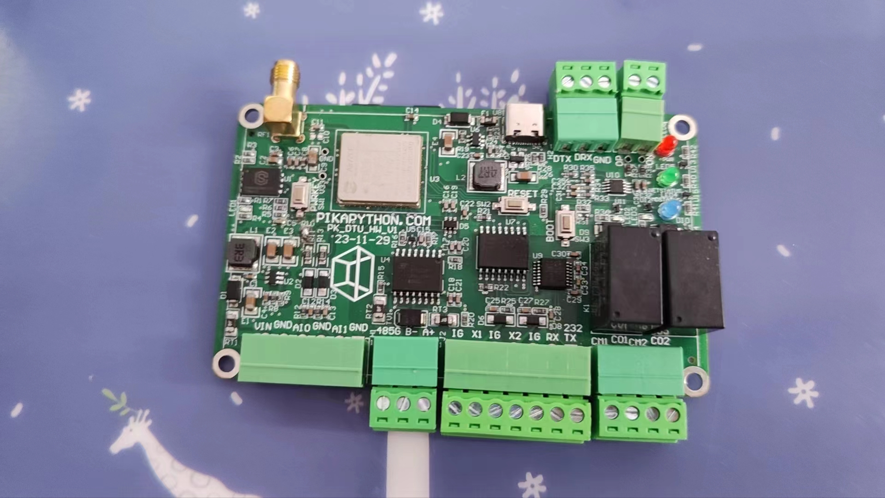
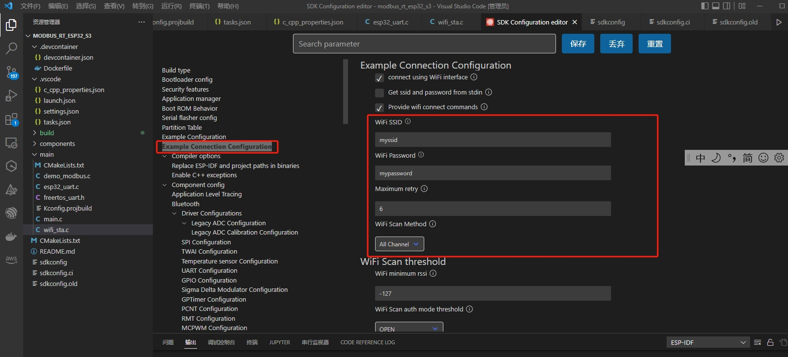
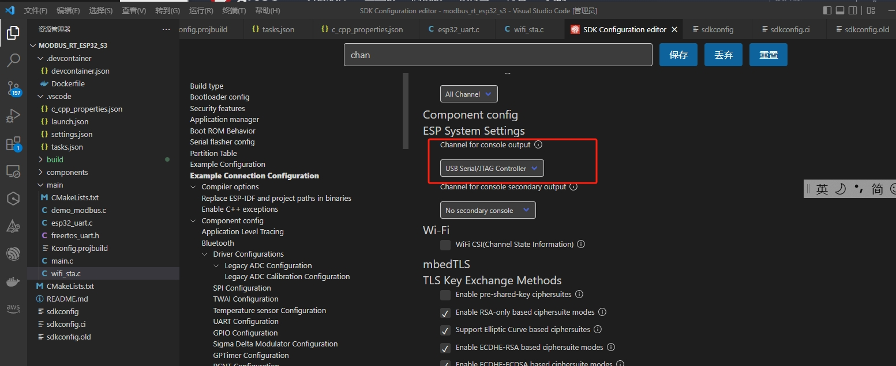

# modbus_rt: Cross-platform modbus protocol communication library implemented in pure C

<p>
	<a href="README.md" >中文页</a> |
	<a>English</a>
</p> 


For a video demonstration of this project, see:

​	Bilibili: https://www.bilibili.com/video/BV1cc411m72m/

### Introduction

​		modbus_rt is a modbus communication library entirely implemented in C that can run on Windows, Linux, MacOS, and RTOS. Its main purpose is for use in control systems and industrial IoT. modbus_rt supports both slave and master modes, based on a socket-like handle concept, facilitating support for multiple instances. It encompasses not only the parsing and implementation of the modbus protocol but also aims to provide a ready-to-use application layer encapsulation, minimizing the need for application-layer porting.

​		modbus_rt supports nearly all commonly used modbus protocols, including **modbus RTU**, **modbus ASCII**, **modbus TCP**, **modbus TCP over UDP**, **modbus RTU over TCP/UDP**, **modbus ASCII over TCP/UDP**, and can operate in both **Slave** and **Master** modes. Additionally, modbus_rt provides endian conversion function interfaces (supporting **4 types of endian modes**), facilitating the conversion of modbus registers to various data types (including bytes, strings, ints, longs, floats, doubles) across different platforms.

​		modbus_rt also offers an interface implementation based on pikapython, integrated into pikapython's official package manager. This allows for the implementation of modbus communication functions using python scripts, seamlessly compatible with the pikapython environment (future consideration may be given to providing interfaces based on micro python and Cpython, depending on familiarity with their underlying packaging, time permitting, and interest).

​		Furthermore, as modbus_rt is written in pure C, future considerations include supporting its compilation into a dynamic link library for use with other programming languages (primarily for use with C#, with most control HMI platforms based on QT or C#). Currently, no DLL encapsulation is provided, so it is only available based on QT demos.

##### 1、 Main Features of modbus_rt:

1. Runs seamlessly on most platforms, including Windows, Linux, and embedded RTOS systems (plans to maintain rt-thread and FreeRTOS systems).
2. Implements application layer interfaces using threads, allowing for the rapid implementation of multiple modbus instances. Supports nearly all modbus protocols, in both Slave and Master modes.
3. Supports 4 different endian data conversion modes, providing functions for converting modbus registers to various data types (including bytes, strings, ints, longs, floats, doubles) across different platforms.
4. Based on an object-oriented mindset using handle mode, which is very convenient for implementing multiple instances of modbus. Theoretically, as long as performance, memory, and space are sufficient, an unlimited number of modbus instances can be created.
5. **In TCP mode, modbus master supports reconnect functionality** (including tcp master and rtu/ascii master over tcp). In modbus network communication, since the slave is the server and the master is the client, network or server issues may occur (some servers, to ensure performance, automatically handle short connections. That is, after each modbus communication, they proactively disconnect from the client to reduce performance overhead). In such cases, the master needs to check whether the server has disconnected each time communication occurs, and if so, reconnect. modbus_rt supports an internal reconnect mechanism, allowing communication without needing to re-establish connections, as the application framework automatically handles reconnects (both on-demand and periodic reconnects are managed internally, with periodic reconnects toggleable via macro definition—for servers that automatically disconnect, consider disabling periodic reconnects; otherwise, the system may attempt to reconnect to the server at intervals).
6. **Under modbus mode based on UDP communication interface, network device discovery and search functionality is provided**. That is: when the modbus slave end (generally referred to as the device end, hereinafter referred to as the device end) and the modbus master end (generally the PC client or application end, hereinafter referred to as the client end) are under the same router or switch but not on the same subnet (the device end's IP address is unknown), the client end can broadcast modbus commands to the broadcast address 255.255.255.255. Upon receiving the broadcast information, the device end will check the IP address of the broadcasting device. If it is not on the same subnet, it will default to broadcasting the response information to 255.255.255.255. At this time, the client end can obtain the IP address of the modbus_rt device end, enabling device address discovery. Additionally, based on this foundation, the functionality to modify the device's IP address can be extended (see the rt-thread platform demo for details).
7. **In slave mode, modbus_rt adds two callback function interfaces: set_pre_ans_callback and set_done_callback**, facilitating rapid implementation of conversions between modbus protocols, such as between modbus RTU, ASCII, TCP, and other protocols (third-party protocols must be implemented independently). This can quickly implement DTU-like applications to meet various industrial IoT application needs (see the modbus dtu case demo for details).
8. **modbus_rt provides a scripting application layer API, currently implemented based on pikapython** (mainly because pikapython itself uses python3 syntax and supports cross-platform support without systems, including Windows, Linux, RTOS). It supports script parsing and bytecode running modes and provides a REPL interactive module. Thus, it can be seamlessly integrated into the system, or like a terminal, it can be used to validate functionality based on REPL command-line mode.
9. **(Added 2024-01-31) Supports automatic modbus function code implementation for file downloading and uploading**: This can conveniently use modbus_rt to implement firmware upgrades and other file downloads/uploads (such as pikapython bytecode). Additionally, it is possible to choose to use mbedTLS to encrypt firmware and files, implementing encrypted file downloads and uploads.

##### 2、 Additional Notes on modbus_rt:

1. The protocol parsing part of modbus_rt is based on the open-source agile_modbus protocol stack and modified accordingly. The slave_util part has been rewritten, mainly to support dynamic binding of slave registers, even allowing for adding slave registers during operation.
2. The serial communication part on Windows and Linux (theoretically also runnable on macOS systems) uses the open-source libserialport serial communication library, called through dynamically linked libraries. The RTOS part of the serial communication code is written independently.
3. The network communication part of modbus_rt uses the BSD Socket interface, so theoretically, any platform that supports BSD Socket can use it. Note that to handle multiple socket blocking issues, IO multiplexing interfaces (select mechanism) are used, so the system needs to support the select interface. Both Windows and Linux inherently support this, but RTOS systems need to ensure that the system has ported BSD socket and supports select.
4. The application implementation layer of modbus_rt uses multi-threading on operating systems such as Windows, Linux, and macOS, using pthread multi-threading. Linux and macOS natively support pthread, while Windows requires loading and installing the pthread library.
5. This project references and borrows from, but is not limited to, the following open-source projects: agile_modbus, libserialport, PikaPython, PikaPython-OpenHardware, RT-Thread, FreeRTOS, etc. (if there are unlisted projects, please specify). Addresses of used and referenced open-source projects can be found in the final acknowledgment section, and everyone is welcome to like and exchange ideas. Thanks to the authors of the above open-source projects.

### Major Update Records

##### 1、Update on 2024-03-01

1. Fixed an issue in modbus_rt slave mode where binding slave registers out of order could lead to data loss in the linked list. (Previous tests were based on sequential order, and comprehensive tests were not conducted. If addresses are disorganized, errors may occur; this issue has been fixed in the latest version) — thanks to the user "Haoyue" for discovering this bug.
2. Added support for modbus_rt on the freeRTOS system and provided demo examples on the ESP32 and air780e hardware platforms.
3. Added a cmsis_rtos2 RTOS compatibility layer platform interface port (provided and ported by the user "Haoyue"). I have not yet verified this interface. For users who are not using rt-thread or freeRTOS, they can try using the cmsis_rtos2 compatibility layer. I will provide a verified demo example when I have time.

##### 2、Update on 2024-01-31

 1. Modified the SLAVE_DATA_DEVICE_BINDING macro definition to be determined by both the SLAVE_DATA_DEVICE_BINDING macro definition and the dev_binding flag variable, indicating whether to bind SLAVE hardware peripherals to registers. Therefore, when hardware peripherals need to be bound, the modbus_xxx_set_dev_binding(xxx_modbus_device_t dev, int flag) function must be called to implement the binding variable; otherwise, it defaults to no binding and can exist as a completely independent modbus instance. This is done so that, on the interaction end, code based on DTU on the PC can run on embedded devices with almost no porting.

 2. Added file transfer functionality based on modbus (similar to tftp, implemented using custom modbus function codes, which can be modified in mosbus_p2p.h), which can be used to implement firmware upgrades (encrypted transmission and upgrades of firmware can be selected). Additionally, it can implement direct transmission of pikapython bytecode over serial or network to the device end (if the device end supports a file system), allowing the device end to run bytecode directly, making pikapython operation on the device end more efficient and convenient (this feature can be enabled or disabled via macro definition; disabling file transfer functionality maintains compatibility with previous versions).

 3. Integrated into the official repository of pikaPython, allowing the use of pikaPython's package management tools for loading and updating. Additionally, endian conversion, RTU, and TCP were separated to facilitate users who only need to use Modbus TCP or modbus RTU to quickly integrate modbus_rt into their projects (requires RTOS or operating system support, currently does not support bare metal operation of modbus_rt).

 4. Synchronized the protocol parsing part of modbus with agile modbus, updating to version 1.1.4 of agile modbus.

 5. The examples in the example section have not yet been updated to the latest version; I will update them when I have time.

    > **Please note:** Considering the first item may cause some users who used the previous version of the code (limited to the device end, where hardware itself was bound to IO peripherals) to encounter compatibility issues after upgrading to the latest version (after creating a modbus slave instance, in addition to setting the SLAVE_DATA_DEVICE_BINDING macro definition to 1 to enable, an additional modbus_xxx_set_dev_binding function is needed to fully implement the hardware binding function). If you do not need the above functionality, you can directly use the betaV0.1 version released (it is recommended to use the latest version, as some minor bugs have been updated and fixed in the latest version, so the betaV0.1 version is limited to users who have already used this communication library and have no additional needs to prevent updates causing incompatibilities).

### Testing and Usage

##### 1、 Windows Platform

​		On the Windows platform, we use QT+MSVC for compiling and testing (theoretically, Visual Studio—based on MSVC, or MiniGW—based on GCC can also be used). We provide two demos: modbus_rt_slave_test and pikapython_test.

1. The modbus_rt_slave_test test program runs three modbus examples: modbus rtu slave, modbus tcp slave, and modbus tcp slave over udp. We can communicate with any of these modbus types, here we directly use the second example, pikapython_test, for testing (of course, other software or devices can also be used for communication, such as the modbus poll software). Simply open the project in QT, modify the serial port number and the IP address of the network card used by the computer, and compile.


2. The pikapython_test test program is based on the pikapython environment built for modbus_rt, allowing us to directly execute python programs to test modbus communication. It can also be run in a REPL interactive terminal, and this demo can run all modbus instances. In `example\code_py`, we have prepared modbus test programs. To facilitate testing, we also provide the compiled executable program, located in the `example\windows\pikapython_test_release` directory. You can double-click `pikapython.exe` to run the REPL environment directly, or enter `pikapython xxx.py` in the terminal to run the corresponding python file (note that the terminal run directory should be set to that directory, and the program to be executed should also be copied to that directory).

Here, we simply test using the pikapython_test program, running `rtu_master.py`, `tcp_master.py`, `udp_master.py` for basic functionality testing. Detailed testing methods can be referred to in the demonstration video (details are not repeated here):

​		We can also use pikapython_test for more functionalities, which can be referred to in later cases.

​		If you need to compile into your own application, simply copy the code in the src directory into the project, install the pthread library and libserialport library, and add the headers as needed, referring to the two QT+MSVC source projects we provide.

##### 2、Linux Platform

​		The Linux platform can theoretically use any standard Linux system hardware. Here, I use the Wildfire Luban Cat 1 as the testing platform, based on the Rockchip RK3566 platform. I just happened to have this development board on hand, and many ROS robotic systems currently on the market use this development board, which has certain representativeness. modbus_rt is an upper-layer application development API, so it is actually hardware-independent.


​		We provide two demos with the same functionality as on Windows. We can compile them directly to run. Since setting up a Linux environment may be somewhat difficult for beginners, here is a brief description of the build environment and compilation process. Detailed testing methods can be referred to in the demonstration video, where we provide a case, which is to use two USB to 485 cables to connect Windows and Linux and then conduct mutual communication testing.

​		Here, we flashed the latest Debian desktop version of firmware provided by Wildfire. Ensure that git, cmake, and gcc are installed. If not installed, you can install them using `sudo apt install cmake` and `sudo apt install git` (since the system on my development board is installed in EMMC, and the flash space is insufficient, so the code is compiled on a tf card, which I mounted to the `/home/cat/sdcard` directory, which requires attention to give `/home/cat/sdcard` directory operating permissions):

```shell
sudo mount /dev/mmcblk1 /home/cat/sdcard
sudo chown -R cat /home/cat/sdcard
chmod -R 755 /home/cat/sdcard
```

> Note: If you need to compile libserialport under Linux, you also need to install autotools related tools, because libserialport is compiled based on autotools tools under Linux. If you need to compile examples under libserialport, you may also need to install pkg-config tools. Please install the corresponding compilation tools as prompted.

1. Download the source code for libserialport and modbus_rt, with the address for libserialport detailed in the project addresses mentioned later.

```shell
git clone https://github.com/sigrokproject/libserialport.git
git clone https://github.com/SenySunny/modbus_rt.git
```

2. Install autotools tools and pkg-config tools

```shell
sudo apt-get install autotools-dev autoconf automake libtool
sudo apt-get install pkg-config
```

3. Compile and install the libserialport library

```shell
cd libserialport/
./autogen.sh 
./configure 
make
sudo make install
sudo ldconfig
```

4. If you need to run examples under libserialport, you can enter the examples directory and execute make to compile.

```shell
cd examples/
make
```

   	 At this point, you can run the example, such as the following is the result of running `./list_ports`, showing two serial ports, one is the system debug serial port, and the other is my external USB to serial module:

```shell
cat@lubancat:~/sdcard/libserialport/examples$ ./list_ports 
Getting port list.
Found port: /dev/ttyFIQ0
Found port: /dev/ttyUSB0
Found 2 ports.
Freeing port list.
```

5. Compile and run modbus_rt (note to modify the code's IP address and serial number information before compiling)

```shell
cd ~/sdcard/modbus_rt/example/linux/modbus_rt_slave_test
sh make.sh
sudo build/modbus_rt_linux 
```

6. If you want to run the pikapython_test case, the compilation method is the same,

```shell
cd ~/sdcard/modbus_rt/example/linux/pikapython_test
sh make.sh
sudo build/modbus_rt_linux 
```

​			or enter the directory to run a specific file, such as running the test.py file directly below:

```shell
cd build
sudo ./pikapython test.py 
```

7. You can run and test modbus_rt related functions

​		The testing method is the same as on Windows, with the difference being that Linux terminals and Windows terminals are slightly different. Windows terminals can directly enter the program name to run the program, while Linux terminals check if there is a program with that name under the environment variable and do not directly run the program under the directory, so you need to enter `.\pikapython` or run `.\pikapython xxx.py` to run the program. Additionally, if the program's socket uses ports below 1024, such as the default modbus 502, you need to run it in administrator mode, entering `sudo .\pikapython` or `sudo .\pikapython xxx.py` to run the program. This is because Linux systems by default do not allow users to use ports below 1024.

> Another point to note: If you use a Windows or Linux system as the device end. When enabling the slave mode based on UDP, if you want to enable the device IP discovery function, the Windows system needs to specify the network card's IP address when creating the slave device, similar to "192.168.28.150" used in Windows testing. BSD socket under Linux or RTOS systems needs to use NULL or an empty string "" to specify the default IP address; otherwise, it will not receive broadcast data packets from 255.255.255.255.

##### 3、RT-Thread Platform

​		The RT-thread platform demo provides two sets of hardware, one of which is a DIY PLC development board I made earlier. Considering that users do not have this board for verification, and the network part of this board uses the W5500 network chip, I added a case demo based on "Wildfire STM32F407_Jiaoyang Development Board," which is implemented based on the "Wildfire STM32F407_Jiaoyang Development Board." Information about this development board can be referred to at "Wildfire Documentation Download Center: https://doc.embedfire.com/products/link/zh/latest/mcu/stm32_motor/ebf_stm32f407_jiaoyang/download/stm32f407_jiaoyang.html"

###### （1） Based on APM32E103VET6 + W5500

​		The RT-thread platform demo uses a DIY PLC development board I made earlier, with a case completely compatible with Siemens's S7-200 PLC case. The main control here uses a domestic semiconductor's APM32E103VET6 chip (basically compatible with STM32F103VET6, pin-to-pin compatible, but with twice the RAM of STM32, 128K, STM32 only has 64K, and the main frequency of APM32 is 120Mhz), and the network part uses a W5500 network chip. Running the rt-thread system. Circuit diagrams and test code can be seen in `example\rt-thread\apm32e103vet6`


​		

​		This hardware has two RS485 interfaces. Our code defaults to using the RS485 closest to the network card for terminal testing. We connect the network cable and RS485 cable (one for modbus communication, one for terminal debugging), power up, compile, and download to the hardware platform. We can control and read the status of IO using modbus poll, or use the previously compiled Windows or Linux application programs to run modbus master examples and communicate with them.

> ​		Here, a brief explanation of the code is given. We created three slave examples: one for modbus rtu slave on RS485, one modbus tcp slave, and one based on modbus tcp slave over udp. The udp slave supports device discovery functionality.
>
> Register distribution is as follows:
>
> 0x-Register：	20000~				: DO output register
>
> 1x-Register：	10000~				：DI input register (read-only)
>
> 3x-Register：	8000-8007			: Stores the device's basic information
>
> ​						8008-8015	  		：Device hardware address (here refers to the MAC address), note that 8008 stores the address length     
>
> ​														 	(here is 6), 8009-8011 stores the MAC address, 8012~8015 are not used here.
>
> ​						8016-8025			:	Stores the device's network information, which are IP address, subnet mask, gateway address,      
>
> ​															primary DNS server, secondary DNS server. Each occupies 2 addresses.
>
> 4x-Register：	2008-2015	    ： Introduces MAC address matching functionality, specifically for modifying network information 
>
> ​															via broadcast. Definition is the same as 8008-8015.
>
> ​						2016-2027			： Modify network information address registers, 2016-2025 addresses are IP address, subnet mask,      
>
> ​															gateway address, primary DNS server, secondary DNS server, each occupies 2 addresses.      
>
> ​															2016 as modification confirmation identifier, indicates which information to modify, can take values from 0~5.  
>
> ​															Default 0 does not modify,
>
> ​																1	indicates only passing ip, subnet mask and gateway use default (subnet mask defaults to 255.255.255.0, 
>
> ​																		gateway address defaults to ip same segment's xxx.xxx.xxx.1);
>
> ​																2	indicates only passing ip and subnet mask, gateway uses default;
>
> ​																3	indicates ip, subnet mask, and gateway are modified simultaneously)
>
> ​																4	adds modification of the primary DNS server
>
> ​																5	modifies all information.
>
> ​													2017 to enable DHCP mode, setting 1 indicates enabling, only effective for current, setting after DHCP gets      
>
> ​													the IP address and other network information will be stored in 3x register's 8016-8025, after reboot, the system      
>
> ​													will return to static ip mode, and set the last DHCP IP as static IP, so this mode is used for when the router's available 
>
> ​													IP is unknown to let the router automatically assign an ip to the device.

​		This code and the modbus_rt_slave_test function on Windows and Linux are consistent, i.e., running three modbus slave instances based on RS485, tcp, and udp. For udp, we added network device search and device network information modification functionality. Additionally, we wrote a QT-based upper computer program for finding and modifying device IP information (itself also based on modbus_rt), located in the `example\windows\tools\find_device` directory. After we compile the program and download it to the microcontroller, we can use this software to find and modify the device's IP (this software supports multiple devices searching simultaneously, but modifying cross-segment device network information does not support multiple devices by default, mainly because: finding devices is through broadcast search, but if the found device and the computer are not in the same segment, network information will be modified through broadcast, but if the found device itself and the computer are in the same segment, directed IP address information will be sent).

> The RT-Thread platform code has been modified to add MAC address matching functionality, thus supporting cross-segment multi-device modification functionality (it is important to note: MAC address matching functionality does not belong to the modbus_rt application framework. It needs to be implemented and matched by the application end, and it is essential to ensure MAC uniqueness. If multiple devices have the same MAC, this functionality may cause issues. The latest version of the firmware code has added MAC address matching functionality.).

​		Currently, the upper computer for finding and modifying device IP is only available on the Windows platform. The Linux platform is not yet provided, and the usage method will be demonstrated in the video.


For a brief introduction and usage instructions for the software, see [Tool Software Usage Instructions](example/windows/tools/ReadMe.md)

###### （2） Based on STM32F407 + lan8720A + lwip

######  

​        Here, we made two demos based on the Wildfire STM32F407_Jiaoyang development:

1. The first demo, like the one based on APM32E103VET6, adds the network device discovery function, which can be used to discover devices and modify the device's network information through the "Find and Modify Device IP Upper Computer."
2. The second demo, since it runs python code on an embedded platform. Considering file transfer, here we use the development board's SPI Flash to establish a FAT file system, binding it to the USB_DEVICE_MSTORAGE device, thus allowing the development board to be used as a USB drive. When you need to copy python files, simply connect the USB device, and the file system will be mounted on the USB_DEVICE_MSTORAGE device, at which time you can copy and edit the PikaPython python code inside. After editing and saving, disconnect the USB, and at this time, the file system will be directly mounted under the FATFS file system. You can then execute the corresponding python code through the MSH command line (of course, there are many other ways to implement file transfer, such as through TFTP protocol, here we only provide a demo example).
3. Additionally, in code_py, we added a case using STM32 to implement modbus TCP to RTU DTU, as we have already done register binding on STM32, so this demo is slightly different from the PC version, and the code is as follows:

```python
import modbus_rt
import modbus_rt_defines as cst

serial_name = "uart4"
ip_addr = ""

rm = modbus_rt.rtu(cst.MASTER)
rm.set_serial(serial_name)
rm.open()
ts = modbus_rt.tcp()
ts.set_net(ip_addr, 502, cst.SOCK_STREAM)
def pre_call(evt) :
    slave = evt.slave
    function = evt.function
    addr = evt.addr
    quantity = evt.quantity
    if cst.READ_DISCRETE_INPUTS == function: 
        if addr >= 0 and addr <= 16 :
            data = rm.excuse(slave, function, addr + 10000, quantity)
            ts.excuse(cst.WRITE, cst.INPUTS, addr, quantity, data)
    elif cst.READ_COILS == function: 
        if addr >= 0 and addr <= 16 :
            data = rm.excuse(slave, function, addr + 20000, quantity)
            ts.excuse(cst.WRITE, cst.CIOLS, addr, quantity, data)
def done_call(evt) :
    slave = evt.slave
    function = evt.function
    addr = evt.addr
    quantity = evt.quantity
    if cst.WRITE_SINGLE_COIL == function: 
        if addr >= 0 and addr <= 16 :
            data = ts.excuse(cst.READ, cst.CIOLS, addr, 1)  
            rm.excuse(slave, function, addr + 20000, data[0])  
    elif cst.WRITE_MULTIPLE_COILS == function: 
        if addr >= 0 and addr <= 16 :
            data = ts.excuse(cst.READ, cst.CIOLS, addr, quantity)  
            rm.excuse(slave, function, addr + 20000, quantity, data)  
ts.set_strict(0)
ts.set_pre_ans_callback(pre_call)
ts.set_done_callback(done_call)
ts.open()

```

​        The effect of executing this code is that if you write to the 20000 coil register, it defaults to a DO output operation. If you write to the address 0 coil register, it will default to writing to the extended IO module's 20000 coil register through RTU. Similarly, if you read the 10000 discrete input register, it defaults to reading the development board's DI input. But if you read the 0 discrete input register, it will default to reading the extended module's 10000 register through RTU. This conveniently allows for the expansion of IO peripherals or supports Ethernet devices as the main controller, with RTU peripherals as the slave, implementing scheduling of the slave by the main controller. Additionally, it supports the functionality of uploading information from the main device to an upper computer or the cloud.

##### 4、FreeRTOS Platform

​	    For the FreeRTOS platform, we conducted tests on two hardware platforms. One is PikaPython's open-source hardware PikaPython-OpenHardware, based on the ESP32-S3 platform, developed based on ESP-IDF V5.1 version. Theoretically, it can be compatible with all ESP32 devices using ESP-IDF. The development board is completely open-source, with onboard isolated RS485 interface, and the network part can be tested using wifi. Actually, we can use any ESP32 series development board and minimum system board to run this example. The open-source repository for the development board is: [https://gitee.com/Lyon1998/pikapython_openhardware ](https://gitee.com/Lyon1998/pikapython_openhardware), with the development board schematic shown below:


​	    Another platform is based on the air780E 4G Cat.1 module from AirLink, whose core controller uses the Mxic EC618 chip platform. It can also be compatible with air780EG, air780EP, air780EPV, and other modules using Mxic EC618, EC718.

​	    We use the open-source pikapython-air780e development board, which is completely open-source in both software and hardware. The open-source repository is: https://gitee.com/Lyon1998/pikapython-air780e, with the development hardware schematic shown below:



###### （1） Based on ESP32, using the ESP-IDF environment

​        The test code repository for the platform (developed based on idf V5.1 environment) provides two demos, one running modbus_rt and the other running pikapython. The project code is under the example\FreeRTOS\PikaPython_OpenHardware directory:

1. First, install the idf development environment and the vscode idf plugin, which can be referred to in the following document: [https://pikapython.com/doc/board_wireless.html ](https://pikapython.com/doc/board_wireless.html), or refer to the idf development video on Bilibili, here is a recommended video: https://space.bilibili.com/1375767826/channel/collectiondetail?sid=846684
1. Open the corresponding project file in vscode to compile and download. Here, it is especially important to note that the first modbus_rt case uses a hardcoded wifi ssid and password. If you need to modify the ssid and password, press ctrl+p in vscode, enter ">ESP-IDF:SDK Configuration editor (menuconfig)" in the pop-up menu to enter the menuconfig interface. Select the Example Connection Configuration tab on the left and modify parameters such as the wifi router's SSID and password.



3. Additionally, if you are using the ESP32-S3 chip, the default terminal debug serial port uses the USB-UART interface. If you hope to use uart0 to run modbus_rt, you can select USB Serial/JTAG Controller in the Channel for console output option in the menuconfig configuration project to disable the default terminal output function of uart0 (if not disabled, it will cause uart0 as the console port to conflict with modbus communication).



4. If you want to run the PIKA_PI_WIRELESS_FIRMWARE firmware and hope to use wifi to run modbus TCP or other network-based modbus instances, ensure that WiFi is connected to the AP router before using the open function to run the modbus instance; otherwise, it will cause network-based modbus execution to fail due to the network not being connected.

###### （2） Based on air780e, using C language, encapsulating pikapython, compiled with xmake

​        The air780e-based case can directly use the official repository code of pikapython-air780e, with modbus_rt instances already synchronized with the official repository. Repository address: [https://gitee.com/Lyon1998/pikapython-air780e ](https://gitee.com/Lyon1998/pikapython-air780e), please follow the official repository's instructions for compilation and use.

​        Currently, the air780e platform, considering the 4G Cat.1 module has no LAN environment, only adapts modbus RTU and modbus ASCII, and does not adapt modbus TCP or other network-related modbus protocols.

##### 5、Communicating with Siemens PLC

​		Since all four platforms use the PikaPython encapsulated API interface and use scripts for communication, it doesn't matter which platform is used for testing. We use the more commonly used S7-1214C PLC platform for Siemens PLC, here only testing modbus TCP. We provide two demos:

1. S7-1214C runs a modbus TCP master case, connected to our rt-thread platform hardware, using the rt-thread development board as an extended modbus IO module for Siemens PLC. Here, we simply made an application, sampling S7-1214C's I0.0 as a signal connected to IO. After that, DI output from the rt-thread development board is output to DO. For details, refer to the demonstration video.


2. S7-1214C runs a modbus TCP slave case, using mobus_rt running on Windows or Linux as master to operate Siemens PLC's peripherals (including I Q IW and custom holding registers, I corresponding to 1x register, Q corresponding to 0x register, IW corresponding to 3x register). For details, refer to the demonstration video.


​		The PLC project is in the example/PLC directory, created using TIA Portal V15.1.

##### 6、Communicating with Weintek HMI

​		Weintek HMI program: We use Weintek's MT8071IP HMI, combined with our RT-Thread platform hardware, for a DO control and DI detection example. Detailed information about the Weintek screen project is in example/WEINVIEW, opened and downloaded using EBproV6.08.02.500. Theoretically, operations on other HMIs are basically the same, so they are not tested one by one here.


​		Here, we just wrote a simple demo using the Weintek screen to read DI and write into DO to control the development board. Monitoring four input and four output channels. The HMI screen itself can achieve very powerful functions through modbus, which is not elaborated here.


##### 7、Communicating with National Color Serial Screen

​		Considering that many cost-sensitive projects or users will not use HMI (mainly because it is expensive). So here, we also used a national color serial screen for a demo example. National color serial screens, many models support modbus protocol, and the price is even only a few tens of yuan. Here, we chose a 2.8-inch serial screen, model: DC24320M028_1110_0T. We implement the same functionality with this serial screen as with the HMI screen, monitoring DI and controlling DO.


​		The project for the national color serial screen is in example/DACAI, with software using VisualTFT_3.0.0.1232, interface as follows:


​		Since the national color serial screen I used has an RS232/TTL-UART interface, I used a TTL to RS485 module externally during the demonstration, finally connecting to our RT-thread development board.

##### 8、mobus DTU Related Examples

​		Here, we provide a simple example, implementing modbus TCP to modbus RTU functionality. We use a Linux system development board connected to a USB to RS485 module, connected to rt-thread platform hardware (to simulate modbus rtu-based peripherals—such as IO modules, sensor peripherals). Then, we run modbus tcp master on Windows, communicating with Linux to control the IIO on rt-thread platform hardware.

​	Here, mainly verifying the use of modbus_rt's callback function functionality to implement DTU conversion functionality.

1. First, enter the build directory under the linux platform:

```shell
cd ~/sdcard/modbus_rt/example/linux/pikapython_test/build
```

2. Create a `tcp2rtu_dtu.py` file and copy the following code:

```python
import modbus_rt
import modbus_rt_defines as cst

serial_name = "/dev/ttyUSB0"
ip_addr = ""

rm = modbus_rt.rtu(cst.MASTER)
rm.set_serial(serial_name)
rm.open()
ts = modbus_rt.tcp()
ts.set_net(ip_addr, 502, cst.SOCK_STREAM)
def pre_call(evt) :
    slave = evt.slave
    function = evt.function
    addr = evt.addr
    quantity = evt.quantity
    if cst.READ_HOLDING_REGISTERS == function: 
        data = rm.excuse(slave, function, addr, quantity)
        ts.excuse(cst.WRITE, cst.REGISTERS, addr, quantity, data)
    elif cst.READ_DISCRETE_INPUTS == function: 
        data = rm.excuse(slave, function, addr, quantity)
        ts.excuse(cst.WRITE, cst.INPUTS, addr, quantity, data)
def done_call(evt) :
    slave = evt.slave
    function = evt.function
    addr = evt.addr
    quantity = evt.quantity
    if cst.WRITE_SINGLE_COIL == function: 
        data = ts.excuse(cst.READ, cst.CIOLS, addr, 1)  
        rm.excuse(slave, function, addr, data[0])  
    elif cst.WRITE_SINGLE_REGISTER == function: 
        data = ts.excuse(cst.READ, cst.REGISTERS, addr, 1) 
        rm.excuse(slave, function, addr, data[0])  
    elif cst.WRITE_MULTIPLE_COILS == function: 
        data = ts.excuse(cst.READ, cst.CIOLS, addr, quantity)  
        rm.excuse(slave, function, addr, quantity, data)  
    elif cst.WRITE_MULTIPLE_REGISTERS == function: 
        data = ts.excuse(0, cst.REGISTERS, addr, quantity)  
        rm.excuse(slave, function, addr, quantity, data)    
ts.add_block("A", 0, 20000, 10)
ts.add_block("B", 1, 10000, 16)
ts.add_block("C", 4, 0, 10)
ts.set_strict(0)
ts.set_pre_ans_callback(pre_call)
ts.set_done_callback(done_call)
ts.open()

```

> ​        We can see that the main functionality of the code is to create a tcp slave and an rtu master, converting write coil and holding register commands into operations for the external rtu master. When receiving commands to read holding registers and discrete input registers, it first obtains device information from the corresponding address through the rtu master to update its own register information, ensuring the information read corresponds to the rtu slave device's information.

3. We run the corresponding `.py` file

```
sudo ./pikapython tcp2rtu_dtu.py
```

4. Afterward, we can operate the rtu slave devices connected below the dtu through the modbus master device.

> We will gradually provide more application demos based on the situation

### Interface Description

##### 1、 Porting and Usage

1. Create an example through modbus_tcp(mode), modbus_rtu(mode), or modbus_ascii(mode), where mode: 0 represents modbus slave; 1 represents modbus Master. This function is mainly used to create the content of the device block, initialize the mutexes and semaphores needed by the device.

2. Initialize the corresponding parameters using functions like modbus_xxx_set_net, modbus_xxx_set_serial, etc., details can be found in the API manual.

3. Start running the device using modbus_xxx_open, this function is mainly used to establish the device's communication port, create communication-related threads.

4. If the device is temporarily not needed, you can use modbus_xxx_close to close the device, this function is mainly used to end the device communication-related threads, close the device's communication interface.

5. If you completely stop using the corresponding device, you can use modbus_xxx_destroy to destroy the device, this function is mainly used to destroy the device's mutexes and semaphore-related numbers, destroy the device's data information and device letter. At this point, the device pointer will point to a null pointer.

6. The slave adds register data block function as the modbus_xxx_add_block function. Parameters are respectively the register type (default 0, 1, 3, 4 types), register start address, storage data space address, register length (not data length).

7. Use the modbus_xxx_excuse function to get or modify the register value, for slave mode it's for reading or writing its own register values, for master mode it's for reading or writing connected slave device register values.

8. If dtu or modbus to other protocol conversion content needs to be implemented, you can set two callback functions using modbus_xxx_set_pre_ans_callback and modbus_xxx_set_done_callback, called respectively when the slave device receives data from the master end, and after modbus communication ends, protocol conversion related content can be completed in the callback functions (note that callback functions cannot be blocking functions, otherwise it will cause modbus communication timeout).

9. If you need to bind the modbus slave device with the device interface, such as implementing DIDO, PWM, ADC, DAC, motor control, modifying PID parameters, etc., peripheral modules, you can modify the SLAVE_DATA_DEVICE_BINDING macro definition in modbus_config.h to 1, and complete the binding work of hardware peripherals with slave registers yourself. Detailed operations can be referred to in the RT-thread platform embedded demo. The general operation is as follows:

   > You need to add the "device_data.h" header file and complete the following functions:
   >
   >   dev_write_bits：       Write bits register
   >
   >   dev_read_bits：       Read bits register
   >
   >   dev_write_regs：       Write regs register
   >
   >   dev_read_regs：       Read regs register
   >
   >   dev_data2modbus_slave：   Register initialization (bind slave register and hardware peripheral information)

10. modbus_xxx_set_strict is used in slave mode, setting strict to 0 means communication will not perform matching checks on the device address sent by the master, i.e., any address can communicate with this slave device, mainly aimed at implementing dtu and protocol conversion related functionalities.

11. modbus_data_xxx related functions are used for converting registers and various data types to meet communication needs in different scenarios. The device defaults to little-endian mode, and since different devices have different endian modes, different endian modes can be used to convert data.

##### 2、 Four Endian Mode Examples

1. Little-endian byte swap:

   > Register 0: 0x0001, Register 1: 0x0002
   >
   > Represents the number: 0x20001 (131073)

2.  Big-endian byte swap:

   > Register 0: 0x0001, Register 1: 0x0002
   >
   > Represents the number: 0x10002000 (16,777,728‬)

3. Internal big-end, external little-endian(Little-endian)：

   > Register 0: 0x0001, Register 1: 0x0002
   >
   > Represents the number: 0x2000100 (33,554,688‬)

4. Internal little-end, external big-endian（Big-endian）：

   > Register 0: 0x0001, Register 1: 0x0002
   >
   > Represents the number: 0x10002 (65538)


### Support

​		Please click the star in the upper right corner to give me support, and feel free to fork.

                       

​	If this software has helped you, feel free to buy me a coffee~ Thank you very much!

### Contact Information

- Maintained by: SenySunny
- Email: [senysunny@163.com](mailto:senysunny@163.com)

### Acknowledgments to the Following Project Authors

​	This project references or uses content from the following open-source projects, and I would like to thank the creators of the following projects.

1.  [agile_modbus (a lightweight, cross-platform modbus protocol stack): https://github.com/loogg/agile_modbus](https://github.com/loogg/agile_modbus)
2.  [libserialport (a cross-platform serial library): https://github.com/sigrokproject/libserialport](https://github.com/sigrokproject/libserialport)
3.  [PikaPython (a completely rewritten ultra-lightweight python engine): https://github.com/pikasTech/PikaPython](https://github.com/pikasTech/PikaPython)
4.  [PikaPython-OpenHardware (an ESP32-S3 development board to verify pikapython): https://gitee.com/Lyon1998/pikapython_openhardware](https://gitee.com/Lyon1998/pikapython_openhardware)
5.  [RT-Thread (an open-source IoT operating system): https://github.com/RT-Thread/rt-thread](https://github.com/RT-Thread/rt-thread)
6.  [FreeRTOS (an open-source real-time operating system for microcontrollers): https://github.com/FreeRTOS/FreeRTOS](https://github.com/FreeRTOS/FreeRTOS)
