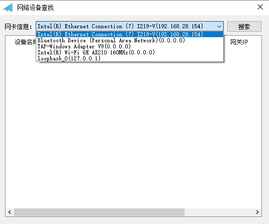
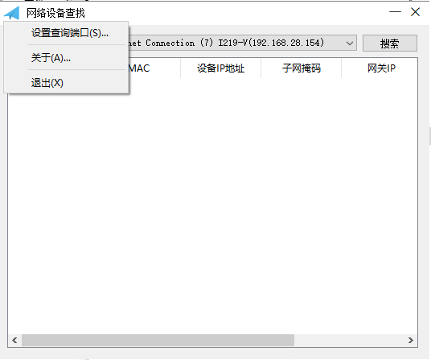
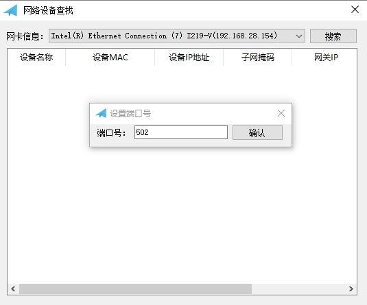
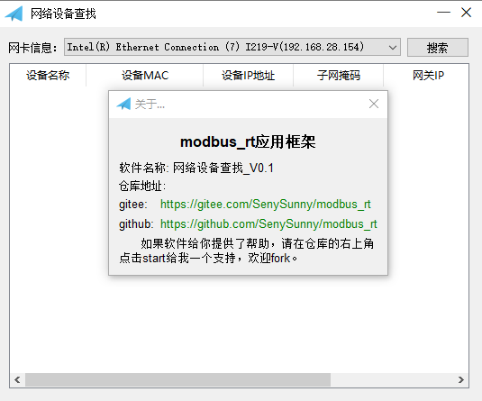

# 工具软件使用说明

### 1、device_find

#### (1) device_find软件介绍

​        device_find是针对modbus_rt写的一个实现UDP设备查找的一个应用程序demo，用于在网络中查找设备。本身也是基于modbus_rt开发的应用程序。

​       软件的基本原理为：选择特定网卡之后，默认以该网卡的IP地址向255.255.255.255发送读取设备的3x寄存器的8000-8031总共32个寄存器的值，然后通过修改4x寄存器2008~2031的值，来实现修改IP地址或者让执行DHCP相关命令等信息，来实现修改设备的网络信息的功能。我们需要在硬件上把相应的寄存器绑定为如下数据：

> 寄存器分布如下：
>
> 0x寄存器：	20000~				: DO输出寄存器
>
> 1x寄存器：	10000~				：DI输入寄存器（只读）
>
> 3x寄存器：	8000-8007			: 存储设备的基本信息
>
> ​						8008-8015	  	：设备的硬件地址(这里便是MAC地址），注意8008存储的式地址长度
>
> ​														（这里是6），8009-8011存储的是MAC地址，8012~8015这里没有使用。
>
> ​						8016-8025		:	这里存储的是设备的网络信息分别是IP地址，子网掩码，网关地址，
>
> ​														首选DNS服务器，备用DNS服务器。每个占用2个地址。
>
> 4x寄存器：	2008-2015	    ： 引入MAC地址匹配功能，针对广播修改网络信息功能。定义与8008-8015相同。
>
> ​						2016-2027		： 修改网络信息地址寄存器，2016-2025地址分别是IP地址，子网掩码，
>
> ​														网关地址，首选DNS服务器，备用DNS服务器，每个占用2个地址。
>
> ​														2016为修改确认标识，表示修改哪些信息，可以取值为0~5。
>
> ​														默认0不修改，
>
> ​																1	表示只传递ip，子网掩码和网关采用默认（子网掩码默认
>
> ​																		255.255.255.0，网关地址默认为ip同一网段下的xxx.xxx.xxx.1）;
>
> ​																2	表示只传递ip和子网掩码,网关采用默认；
>
> ​																3	表示ip，子网掩码和网关同时修改)
>
> ​																4	增加修改首先DNS服务器
>
> ​																5	所有的信息都修改。
>
> ​													2017为开启DHCP模式，设置1则表示开启，仅对当前有效，设置后DHCP获取
>
> ​													到的IP地址等网络信息会存储在3x寄存器的8016-8025当中，重启之后，系统
>
> ​													会回到静态ip模式，并把上次DHCP的IP作为静态IP来设置，所以该模式作用于
>
> ​													在不知道路由器可用IP的情况下让路由自动给设备分配一个ip使用。

​       需要特别注意：由于网络地址的存储格式是采用外部大端，内部小端的模式（详细查看ip_addr_t定义），与常用的控制器存储的方式略有不同，如果采用IP地址四段赋值的方式把数据存储在3x寄存器的8016-8025地址中，需要特别注意这个问题。软件的默认做法是在设备端，直接用uint16_t的指针，指向ip_addr_t的网络地址信息数据内容。如果IP地址存储的大小端模式不一样，会导致上位机这边读取的IP地址错误（设备这边会对收到的数据IP和发送数据端的设备Ip做判断，必须一致才认为数据正确，否则会认为收到的数据错误，而不显示）。

#### (2) device_find简单说明

1. 点击下拉列表，软件会自动列出PC端口上拥有的网口设备，选择与modbus_rt设备端在同一个局域网段的网卡（由于是向255.255.255.255广播信息，所以不需要确定IP是不是在同一个网段，因为此时你可能还不知道设备的IP地址，只需要确保在硬件上处于同一个网段）。点击搜索，理论就可以搜索到设备的信息。

2. 软件默认采用502端口作为设备的广播端口，我们可以电机左上角的软件图标，可以弹出菜单，选择查询设备端口的菜单，进入后即可修改端口号相关的功能如下：

3. 在菜单栏点击“关于(A)...”可以查看到软件的相关信息和仓库的地址， 点击即可进入仓库查看更新信息。

   

   >  如果软件给你提供了帮助，请在仓库的右上角， 点击start给我一个支持，欢迎fork。
